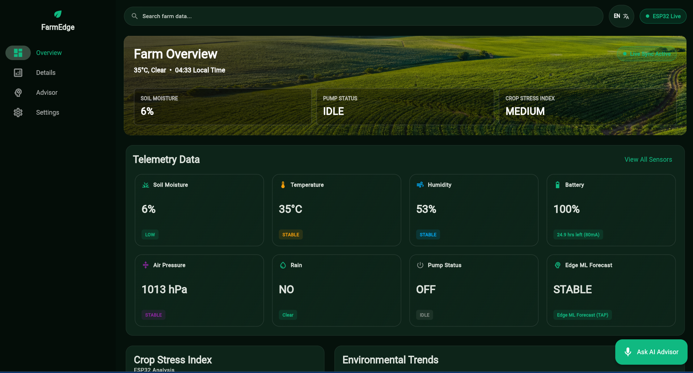
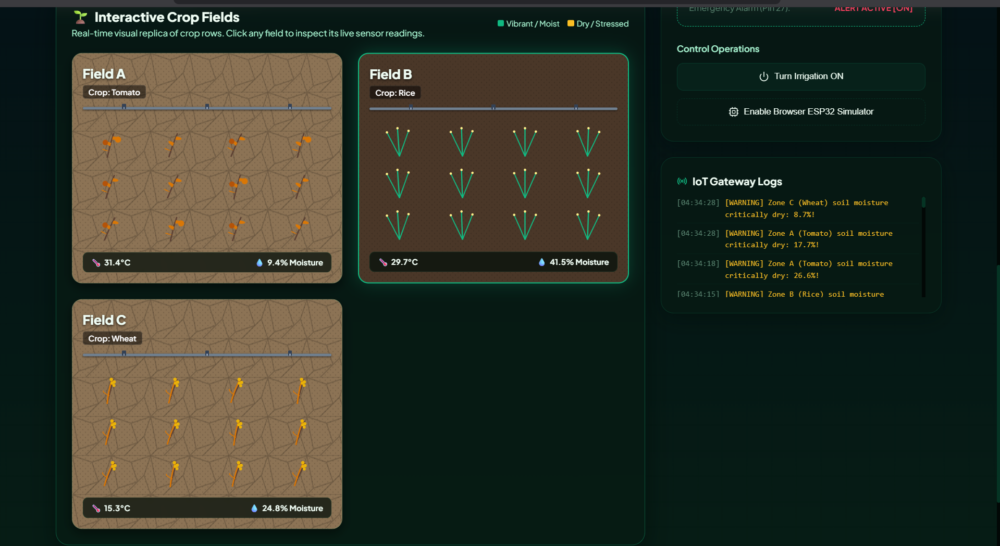
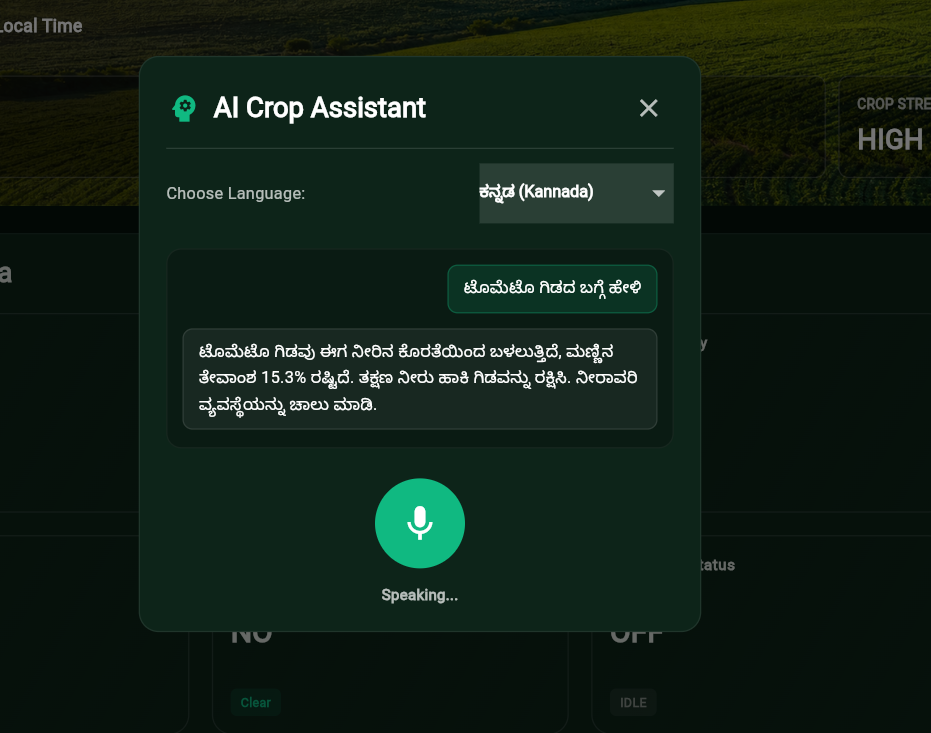
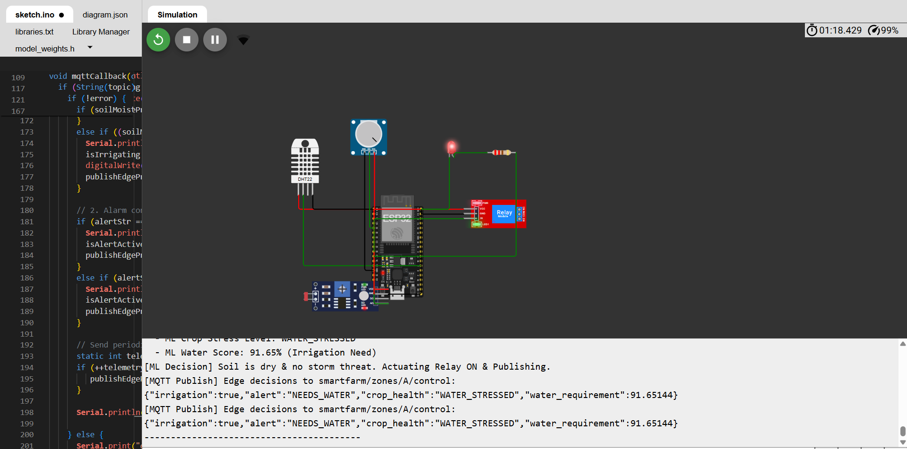

<h1 align="center">
  🌾 KrishiSetu
</h1>

<p align="center">
  <b>Edge-Intelligent Crop Monitoring — No Cloud Required.</b><br/>
  <i>Real-time Digital Twin • TinyML on ESP32 • Multilingual AI Voice Assistant</i>
</p>

<p align="center">
  
  
  
  
</p>

---

## 🎯 Problem Statement

> **PS-4: Edge-Based Crop Monitoring with TinyML**

Rural farms face **unreliable internet**, making cloud-dependent smart agriculture impractical. KrishiSetu moves intelligence to the edge — the ESP32 microcontroller makes irrigation decisions locally using a trained neural network, with **zero cloud dependency** for critical operations.

---

## 🧠 What Makes KrishiSetu Different

| Traditional IoT Farm | KrishiSetu |
|---|---|
| ❌ Sensor → Cloud → Decision → Actuator | ✅ Sensor → **Edge ML** → Actuator (< 50ms) |
| ❌ Fails without internet | ✅ Fully autonomous offline |
| ❌ English-only dashboards | ✅ Voice assistant in **English, Malayalam & Kannada** |
| ❌ Blind remote control | ✅ **Digital Twin** mirrors farm state in real time |
| ❌ No advance weather insight | ✅ **Edge ML weather prediction** + OpenWeather fusion |

---

## 🏗️ Architecture

```
┌─────────────────────────────────────────────────────────┐
│                    EDGE LAYER (ESP32)                    │
│  DHT22 + Soil Sensor + BMP280 → TinyML Neural Network   │
│  ┌──────────┐   Autonomous    ┌────────────┐            │
│  │ Sensors  │ ──→ Inference ──→│ Relay/Pump │            │
│  └──────────┘   (< 50ms)      └────────────┘            │
│         │         ↓                                      │
│         │    Weather Trend                               │
│         │    (Pressure Delta)                            │
│         │                                                │
│         └──── MQTT (HiveMQ) ────┐                       │
└─────────────────────────────────┼───────────────────────┘
                                  │
┌─────────────────────────────────┼───────────────────────┐
│              DIGITAL TWIN LAYER (Node.js)               │
│  ┌─────────────┐  ┌──────────────┐  ┌────────────────┐  │
│  │ Farm State   │  │ AI Voice Chat│  │ Weather Fusion │  │
│  │ Simulator    │  │ (Groq/Ollama)│  │ Edge+OpenWeather│ │
│  └──────┬──────┘  └──────┬───────┘  └───────┬────────┘  │
│         └────────────────┼──────────────────┘            │
│                    REST API (:3001)                       │
└─────────────────────────────────┬───────────────────────┘
                                  │
┌─────────────────────────────────┼───────────────────────┐
│            PRESENTATION LAYER (Flutter Web)              │
│  Live Dashboard • Telemetry Charts • Voice Assistant     │
│  Semi-Automated Irrigation • Weather Prediction Card     │
└─────────────────────────────────────────────────────────┘
```

---

## 📸 Demo

<p align="center">
  
  <br/><i>Live Telemetry Dashboard — real-time sensor cards, trend charts & irrigation status</i>
</p>

<p align="center">
  
  <br/><i>Digital Twin — animated farm zones with live sensor overlays</i>
</p>

<p align="center">
  
  &nbsp;&nbsp;
  
  <br/><i>Multilingual Voice Assistant (EN/ML/KN) &nbsp;•&nbsp; ESP32 Edge Device on Wokwi</i>
</p>

> 📌 **Add your screenshots:** Save them to a `screenshots/` folder in the project root.
> Name them `dashboard.png`, `digital_twin.png`, `voice_assistant.png`, and `esp32_wokwi.png`.

---

## ✨ Key Features

### 🤖 TinyML on the Edge
- Neural network trained on **2,000 agriculture records** with backpropagation
- Predicts **crop health** and **water requirement** scores in real-time
- Runs inference in **< 50ms** directly on ESP32 — no cloud roundtrip

### 🌦️ Weather Prediction (Edge ML + Cloud Fusion)
- **Edge ML forecasting**: The neural network analyzes local sensor patterns (temperature trends, humidity shifts, barometric pressure drops) to predict weather — **works fully offline**
- **Cloud fusion**: When internet is available, real-time data from **OpenWeather API** is blended with edge predictions for improved accuracy
- **Tomorrow's forecast card**: Dashboard displays a one-tap prediction with expected temperature, humidity, rainfall probability, and irrigation advice
- Predictions classified as `STABLE`, `RAIN_COMING`, or `STORM_ALERT` — automatically pauses irrigation before storms to save water

### 🪞 Live Digital Twin
- Server-side simulation mirrors physical farm state
- Synchronized via **MQTT** (HiveMQ public broker)
- Visual sandbox shows animated crop zones with live sensor overlays

### 🗣️ Multilingual AI Voice Assistant
- Speak in **English**, **Malayalam (മലയാളം)**, or **Kannada (ಕನ್ನಡ)**
- Powered by **Groq LLaMA 3.3** (online) or **Ollama** (offline fallback)
- Regional TTS via **Sarvam AI** for natural audio responses

### 🚿 Smart Irrigation Control
- **Automated mode**: ESP32 autonomously controls the pump relay
- **Semi-automated mode**: Sends a confirmation notification to the farmer's dashboard before activating — preventing water waste

### 📊 Real-Time Dashboard
- Live telemetry cards (temperature, humidity, soil moisture, battery)
- Historical trend charts with 60-point rolling window
- Tomorrow's weather prediction using Edge ML + OpenWeather fusion

---

## 🛠️ Tech Stack

| Layer | Technologies |
|-------|-------------|
| **Edge Device** | ESP32, Arduino, DHT22, Soil Sensor, BMP280, Relay Module |
| **Edge ML** | Custom neural network (trained in Python, deployed in C++) |
| **Communication** | MQTT over HiveMQ public broker |
| **Backend** | Node.js, Express.js |
| **AI/LLM** | Groq (LLaMA 3.3 70B), Ollama (Qwen3 4B), Sarvam AI TTS |
| **Weather** | OpenWeather API + Edge ML barometric prediction |
| **Frontend** | Flutter Web, Riverpod, fl_chart, go_router |
| **Simulation** | Wokwi (ESP32 virtual hardware) |

---

## ⚡ Quick Start

### 1. Backend

```bash
cd DigitalTwin/backend
npm install
```

Create `.env`:
```env
GROQ_API_KEY=your_key
SARVAM_API_KEY=your_key
OPENWEATHER_API_KEY=your_key
```

```bash
npm start            # Runs on :3001
```

### 2. Flutter Dashboard

```bash
cd farmedge_monitor
flutter pub get
flutter run -d chrome
```

### 3. ESP32 (Wokwi)

Open the Wokwi project → Upload firmware from `DigitalTwin/wokwi/` → Run simulation.

> The ESP32 connects to the same MQTT broker and syncs with the Digital Twin automatically.

---

## 📡 API Reference

| Method | Endpoint | Description |
|--------|----------|-------------|
| `GET` | `/status` | Live farm telemetry for a zone |
| `GET` | `/api/voice-chat?query=...` | AI voice assistant query |
| `GET` | `/api/weather/predict-tomorrow?zone=A` | ML + cloud fused weather prediction |
| `POST` | `/api/trigger-mode` | Toggle irrigation mode |
| `POST` | `/api/zone/:id/irrigation` | Manual pump control |
| `POST` | `/api/zone/:id/alert` | Set/clear zone alerts |

---

## 🔮 Future Scope

- 📷 Computer vision pest detection
- 🛰️ Satellite weather integration
- 📱 Native Android/iOS apps
- 🔔 SMS alerts for offline farmers
- 🚁 Drone-assisted field monitoring

---

<p align="center">
  <b>🏆 Problem Statement 4 — Edge-Based Crop Monitoring</b><br/>
  <i>Edge Computing • Smart Agriculture • TinyML • IoT • AI</i>
</p>

<p align="center">
  Made with ❤️ using Flutter, ESP32, TinyML, MQTT, Node.js & AI
</p>
